# Flujos App Vacunación Formosa

**Host:** `https://dh.formosa.gob.ar/modulos/webservice/php/`
**Convención API:** `codigo_mensaje "0"` = ERROR · `"1"` = ÉXITO

---

## Navegación entre pantallas

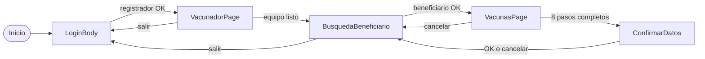

---

## PANTALLA 1 — LoginBody

El registrador escanea su DNI. La app lee el código de barras, extrae el número de documento y lo manda a la API para validar si el usuario tiene permiso.

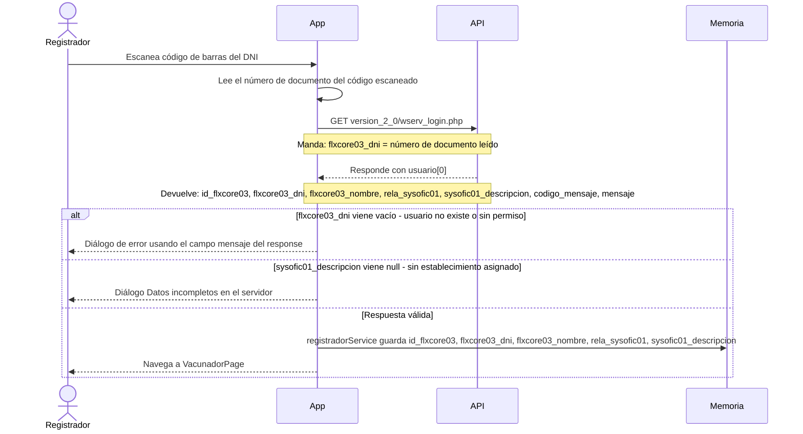

---

## PANTALLA 2 — VacunadorPage

Configura el equipo de trabajo. Al entrar carga los establecimientos disponibles para el registrador. Permite elegir si el registrador es también el vacunador o asignar uno diferente. Tiene opción de marcar si es vacunación en terreno.

### Al entrar — carga establecimientos del registrador

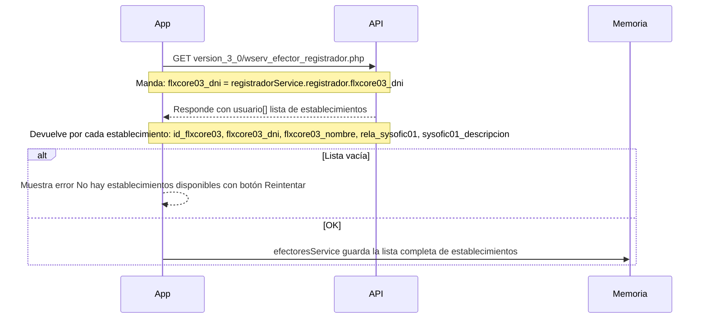

### Si el usuario cambia de establecimiento — sin llamada a la API

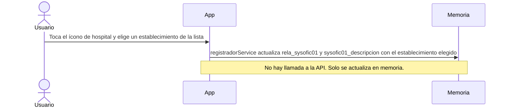

### Switch mismo vacunador = SÍ — sin llamada a la API

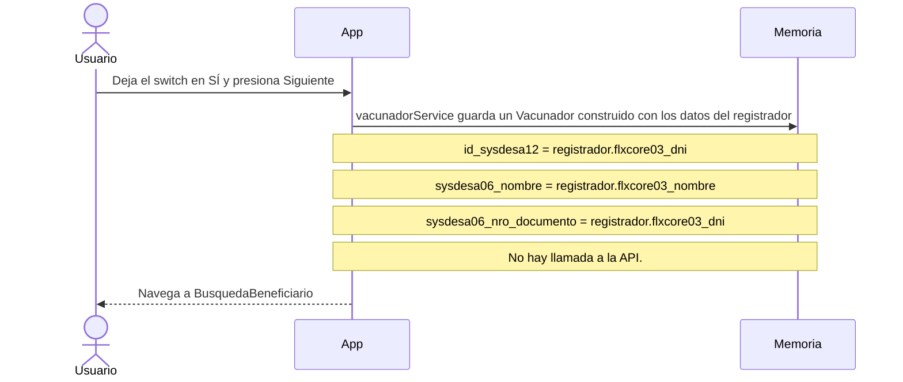

### Switch mismo vacunador = NO — valida al vacunador por DNI

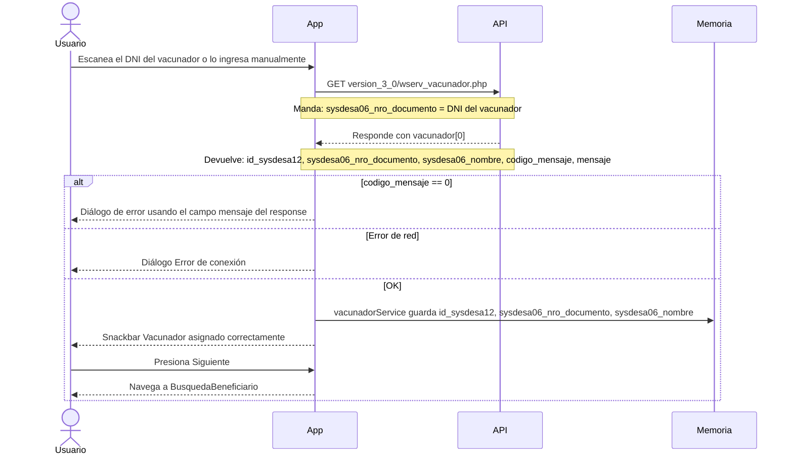

### Switch en terreno — sin llamada a la API

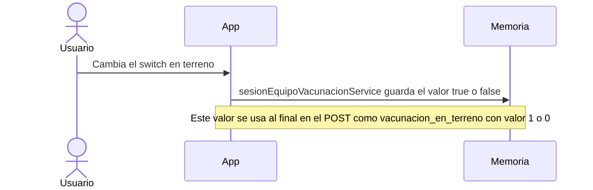

---

## PANTALLA 3 — BusquedaBeneficiario

Busca al beneficiario que va a recibir la vacuna. Se puede buscar escaneando su DNI o ingresando el número manualmente. También carga cuántas vacunas aplicó el vacunador hoy.

### Al entrar — contador de vacunas del vacunador

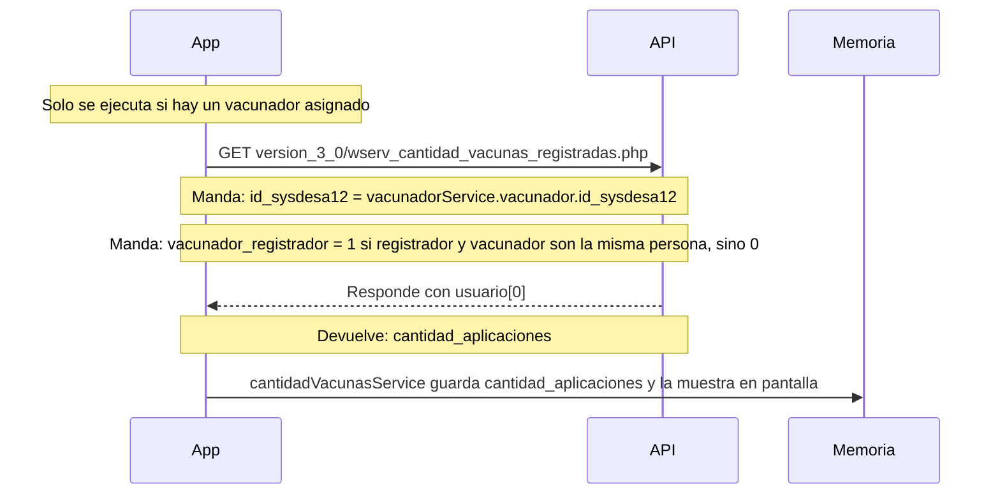

### Búsqueda del beneficiario por escaneo de DNI

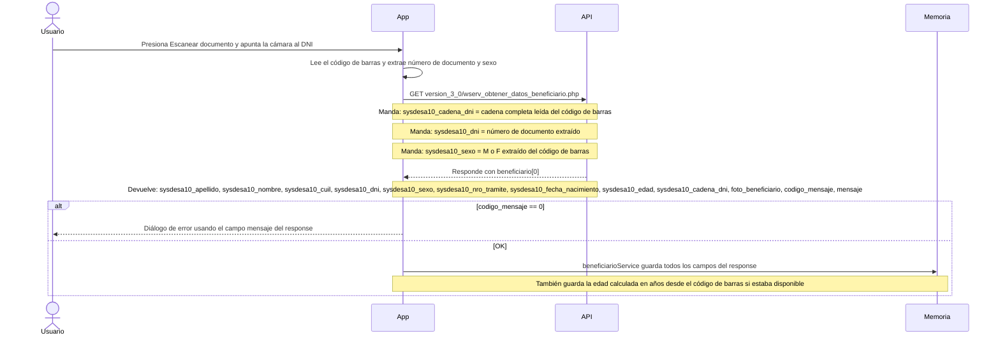

### Búsqueda del beneficiario modo manual

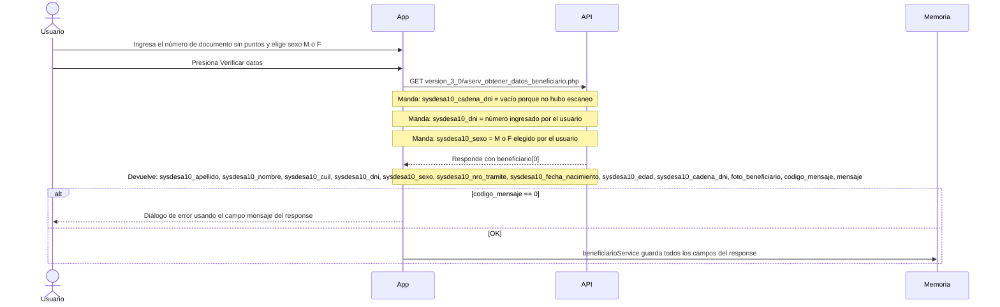

### Historial de dosis del beneficiario — se ejecuta después de encontrarlo

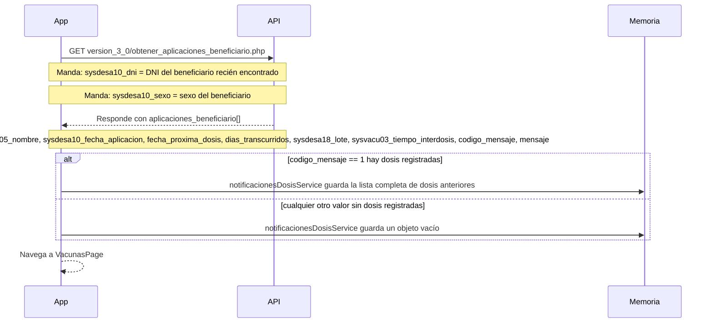

---

## PANTALLA 4 — VacunasPage

Selección paso a paso de la vacuna a aplicar. Cada elección del usuario dispara una llamada a la API para cargar las opciones del siguiente paso.

### Al entrar — carga los perfiles de vacunación

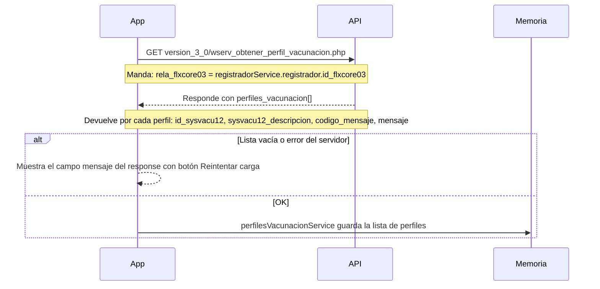

### Paso 1 — Usuario elige un perfil → carga las vacunas de ese perfil

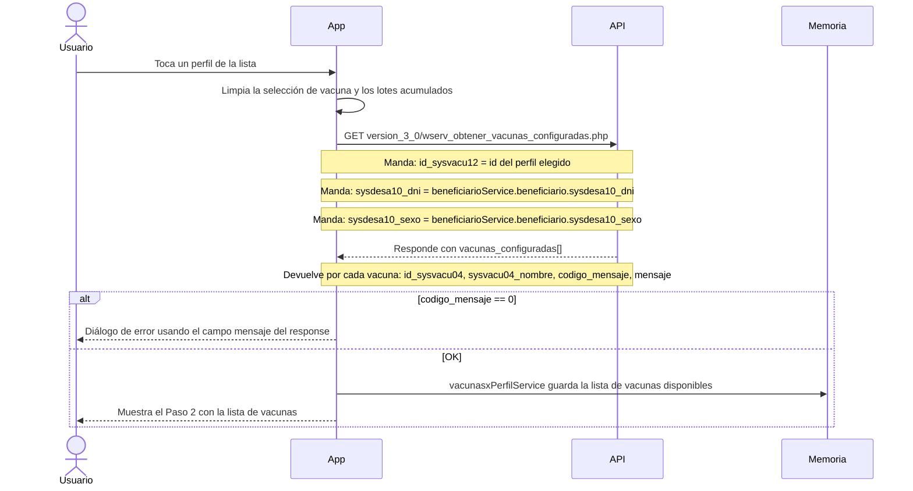

### Paso 2 — Usuario elige una vacuna → carga las condiciones

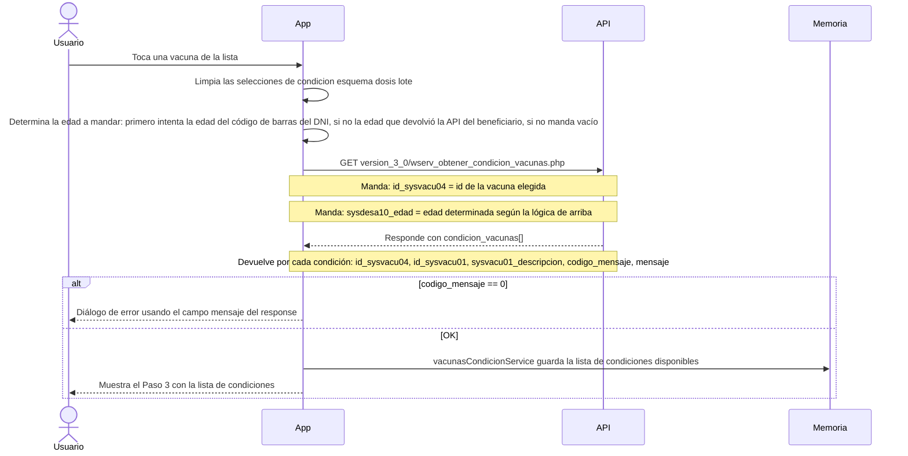

### Paso 3 — Usuario elige una condición → carga los esquemas

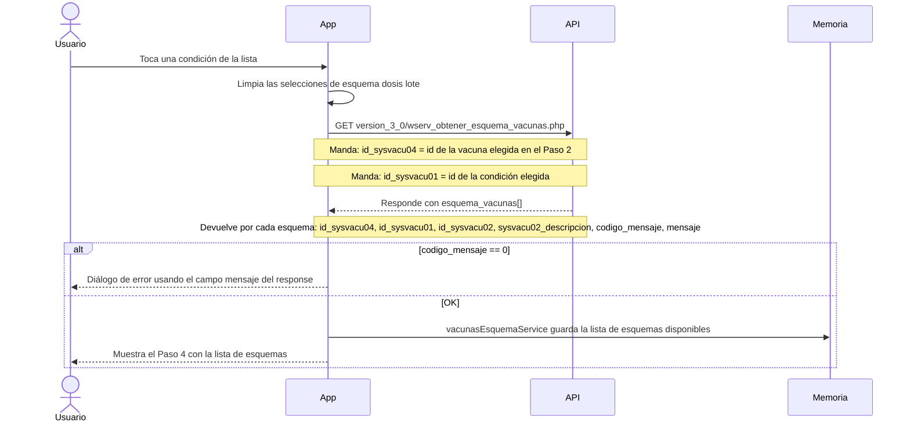

### Paso 4 — Usuario elige un esquema → carga las dosis

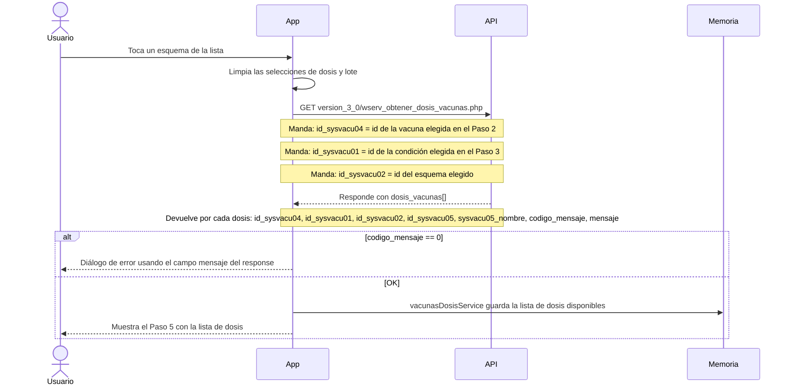

### Paso 5 — Usuario elige una dosis — sin llamada a la API

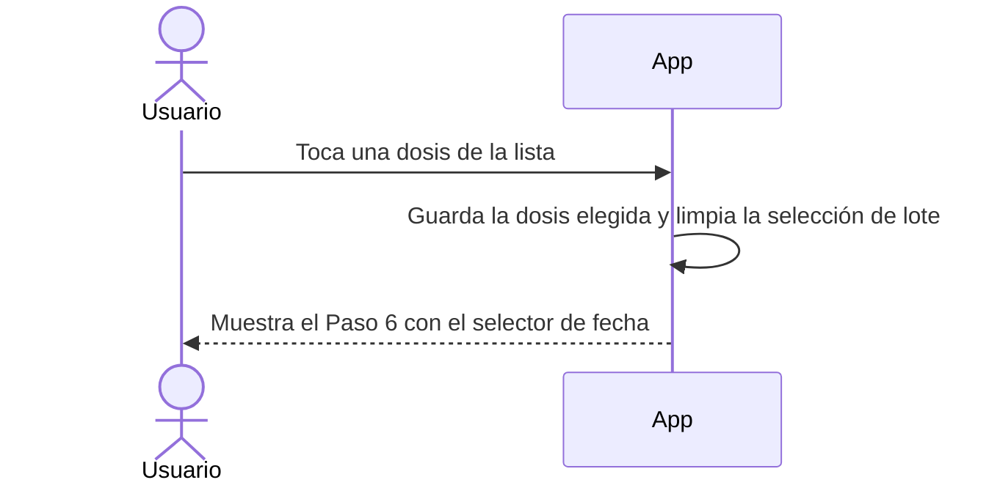

### Paso 6 — Usuario elige la fecha → carga los lotes

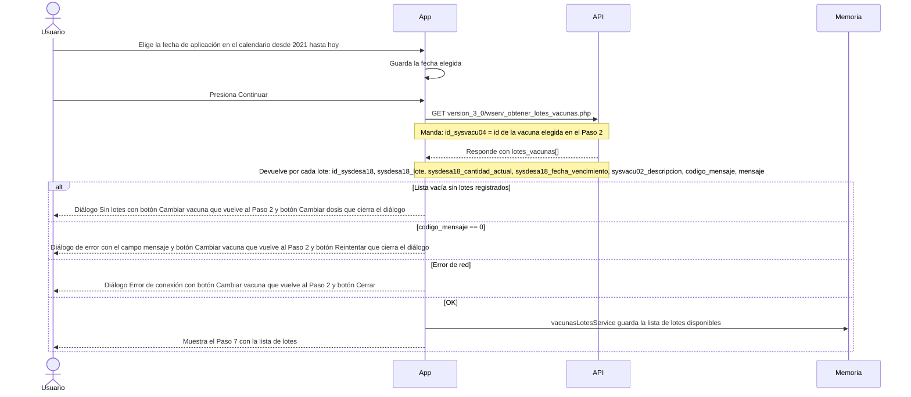

### Paso 7 — Usuario elige un lote — sin llamada a la API

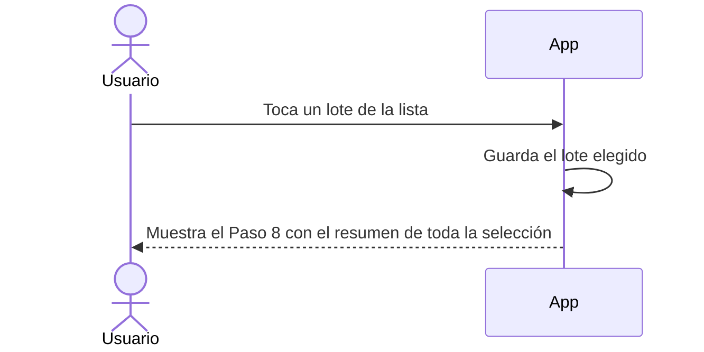

### Paso 7 alternativo — Sin lotes en pantalla

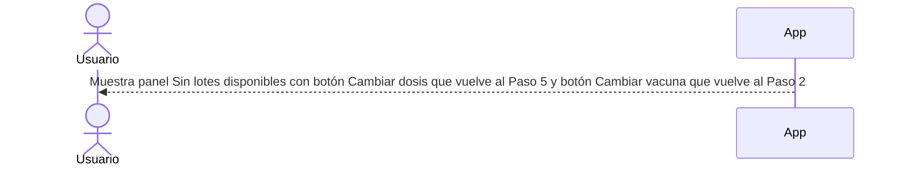

### Paso 8 — Resumen y armado del registro — sin llamada a la API

```mermaid
sequenceDiagram
    actor U as Usuario
    participant APP as App
    participant RAM as Memoria

    APP-->>U: Muestra resumen con perfil vacuna condición esquema dosis fecha y lote elegidos
    Note over APP,U: Cada fila tiene un botón Cambiar que vuelve al paso correspondiente

    U->>APP: Presiona Continuar a confirmación

    APP->>APP: Valida que todos los datos obligatorios estén completos
    Note over APP: Verifica: beneficiario con DNI, vacuna, condición, esquema, dosis, lote
    Note over APP: Si el beneficiario es menor de edad también verifica que haya tutor cargado

    alt Falta algún dato obligatorio
        APP-->>U: Diálogo indicando qué falta completar
    else Todo completo
        APP->>RAM: insertRegistroService guarda el objeto con todos los datos del registro
        Note over APP,RAM: id_flxcore03 del registrador
        Note over APP,RAM: id_sysdesa12 del vacunador
        Note over APP,RAM: id_sysofic01 del establecimiento
        Note over APP,RAM: id_sysdesa18 del lote
        Note over APP,RAM: id_sysvacu04 de la vacuna
        Note over APP,RAM: id_sysvacu01 de la condición
        Note over APP,RAM: id_sysvacu02 del esquema
        Note over APP,RAM: id_sysvacu05 de la dosis
        Note over APP,RAM: sysdesa10_nombre sysdesa10_apellido sysdesa10_dni sysdesa10_sexo sysdesa10_edad sysdesa10_fecha_nacimiento sysdesa10_nro_tramite sysdesa10_cadena_dni del beneficiario
        Note over APP,RAM: vacunador_registrador = 1 si registrador y vacunador son la misma persona sino 0
        Note over APP,RAM: vacunacion_en_terreno = 1 o 0 según el switch de VacunadorPage
        Note over APP,RAM: fecha_aplicacion = fecha elegida en el Paso 6
        Note over APP,RAM: sysdesa10_apellido_tutor sysdesa10_nombre_tutor sysdesa10_dni_tutor sysdesa10_sexo_tutor del tutor o cadenas vacías si no hay tutor
        APP-->>U: Navega a ConfirmarDatos
    end
```

### Si el beneficiario es menor de edad — carga del tutor

```mermaid
sequenceDiagram
    actor U as Usuario
    participant APP as App
    participant API as API
    participant RAM as Memoria

    APP->>APP: Determina si el beneficiario es menor de edad
    Note over APP: Usa la edad del código de barras del DNI si existe, si no la edad del response de la API, si no la fecha de nacimiento del response

    alt Mayor de edad
        APP-->>APP: No muestra el panel de tutor
    else Menor de edad o edad desconocida
        APP-->>U: Muestra panel de tutor obligatorio

        alt Usuario escanea el DNI del tutor
            U->>APP: Escanea el código de barras del DNI del tutor
            APP->>API: GET version_3_0/wserv_obtener_datos_beneficiario.php
            Note over APP,API: Manda: sysdesa10_cadena_dni = cadena completa del código de barras del tutor
            Note over APP,API: Manda: sysdesa10_dni = número de documento del tutor extraído del escaneo
            Note over APP,API: Manda: sysdesa10_sexo = sexo del tutor extraído del escaneo
        else Usuario ingresa el DNI del tutor manualmente
            U->>APP: Ingresa el número de documento del tutor y elige sexo
            APP->>API: GET version_3_0/wserv_obtener_datos_beneficiario.php
            Note over APP,API: Manda: sysdesa10_cadena_dni = vacío porque no hubo escaneo
            Note over APP,API: Manda: sysdesa10_dni = número ingresado manualmente
            Note over APP,API: Manda: sysdesa10_sexo = M o F elegido por el usuario
        end

        API-->>APP: Responde con beneficiario[0]
        Note over API,APP: Devuelve: sysdesa10_apellido, sysdesa10_nombre, sysdesa10_dni, sysdesa10_sexo, codigo_mensaje, mensaje

        alt codigo_mensaje == 0
            APP-->>U: Diálogo No se pudo validar al tutor con el campo mensaje del response
        else Error de red
            APP-->>U: Diálogo Sin conexión
        else OK
            APP->>RAM: tutorService guarda apellido nombre dni sexo del tutor
            APP-->>U: Muestra la tarjeta del tutor cargado en pantalla
        end
    end
```

### Usuario cancela en VacunasPage

```mermaid
sequenceDiagram
    actor U as Usuario
    participant APP as App
    participant RAM as Memoria

    U->>APP: Presiona Cancelar registro y confirma el diálogo
    APP->>RAM: Limpia vacunasxPerfilService perfilesVacunacionService vacunasConfiguracionService vacunasLotesService notificacionesDosisService
    Note over APP,RAM: insertRegistroService no se limpia porque aún no fue construido en este punto
    APP-->>U: Navega a BusquedaBeneficiario
```

---

## PANTALLA 5 — ConfirmarDatos

Muestra el resumen completo antes de enviarlo. El usuario confirma y se ejecuta el único POST de toda la app.

### Lo que muestra la pantalla

```mermaid
sequenceDiagram
    participant APP as App
    participant RAM as Memoria

    APP->>RAM: Lee el registro guardado en insertRegistroService
    Note over APP,RAM: Muestra: vacuna condición esquema dosis lote
    Note over APP,RAM: Muestra: nombre apellido dni del beneficiario
    Note over APP,RAM: Muestra tarjeta del tutor solo si tiene DNI cargado
```

### Usuario confirma — POST al servidor

```mermaid
sequenceDiagram
    actor U as Usuario
    participant APP as App
    participant API as API
    participant RAM as Memoria

    U->>APP: Presiona Registrar vacunación

    APP->>API: POST version_4_0/wserv_registrar_vacuna.php
    Note over APP,API: Header: Content-Type = application/x-www-form-urlencoded charset UTF-8
    Note over APP,API: Query param insertvacunado = JSON serializado como array de un elemento con los campos del registro
    Note over APP,API: id_flxcore03, id_sysvacu04, id_sysofic01, id_sysdesa18, id_sysdesa12
    Note over APP,API: id_sysvacu01, id_sysvacu02, id_sysvacu05
    Note over APP,API: sysdesa10_nombre, sysdesa10_apellido, sysdesa10_dni, sysdesa10_sexo
    Note over APP,API: sysdesa10_nro_tramite, sysdesa10_cadena_dni, sysdesa10_edad, sysdesa10_fecha_nacimiento
    Note over APP,API: vacunador_registrador, vacunacion_en_terreno, fecha_aplicacion
    Note over APP,API: sysdesa10_apellido_tutor, sysdesa10_nombre_tutor, sysdesa10_dni_tutor, sysdesa10_sexo_tutor
    Note over APP,API: ATENCIÓN — el back lee sysdesa10_terreno pero la app envía vacunacion_en_terreno — el campo no se guarda en BD

    API-->>APP: Responde con mensajes[0]
    Note over API,APP: Devuelve: codigo_mensaje, mensaje

    alt codigo_mensaje == 0
        APP-->>U: Diálogo de error con el campo mensaje del response y botón Reintentar que cierra el diálogo
    else Error de red
        APP-->>U: Diálogo No se pudo registrar. Revise la conexión
    else OK
        APP-->>U: Diálogo de éxito con el campo mensaje del response
        APP-->>U: Navega a BusquedaBeneficiario
    end
```

### Usuario cancela

```mermaid
sequenceDiagram
    actor U as Usuario
    participant APP as App
    participant RAM as Memoria

    U->>APP: Presiona Cancelar registro y confirma el diálogo
    APP->>RAM: Limpia vacunasxPerfilService perfilesVacunacionService vacunasConfiguracionService vacunasLotesService notificacionesDosisService insertRegistroService
    APP-->>U: Navega a BusquedaBeneficiario
```
